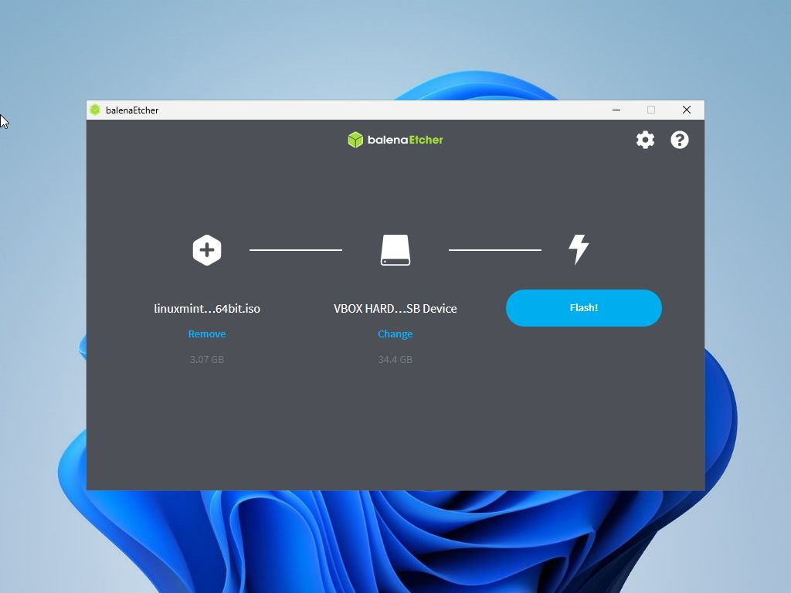

### Co je balenaEtcher

**balenaEtcher** je malý multi-platformní (Windows, Linux, MACOS) program určený pro vytváření bootovatelných USB médií z obrazů.

### Stažení programu
1) Otevřeme si webové stránky **[balenaEtcher](https://etcher.balena.io/)** a klikneme na tlačítko **Download Etcher**.

2) Vybereme si potřebnou verzi pro **náš systém** a vyčkáme na její stažení.

3) Nainstalujeme/Spustíme

    a) **Flash from file** - zvolíme nás obraz určený k zápisu.
    
    

    b) **Select target** - vybereme úložné médium, kam chceme data zapsat.
    
    

    c) **Flash!** - spustíme zápis dat na Flash disk.
    
    
    d) Aplikace po nás bude chtít udělit vyšší práva pro zahájení procesu zápisu. Potvrdíme **Ano**.
    

    e) Průběh zápisu a jeho úspěšné dokončení.
    
    
