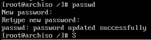

# Úvod

### Důvod vzniku tohoto návodu?
Za léta strávená za PC jsme narazil na různé linuxové systémy jako např. **Damn Small Linux, Slax, Ubuntu, Fedora, Suse, ... a Arch Linux**. Pro začátečníka se zdá Arch Linux těžký a nepochopitelný, ale mohu říct, že jsem o Linuxu řekl mnoho lidem – začátečníkům. Ano, ze začátku bylo hodně pádů, chyb. Zkoušeli to opakovaně, až dosáhli cíle a ještě se naučili pracovat se systém od začátku s **terminálem**.

Ovládat terminál je základ práce s Linuxem. Pokud se něco pokazí, tak skončíme právě v něm. V terminálu se snažíme příčinu najít a opravit.

S Arch Linuxem jsem se seznámil přes bratrance, který v něm pracoval. Mě ten systém nadchl a začal jsem se s ním prodírat. Ano, ze začátku se mi nedařilo, uznávám po letech jsem se k němu vrátil díky **Arch Install Sciptu**, který instalací pro začátek usnadní a urychlí. 

Ale když máte kolem sebe komunitu Linuxáků, kteří sdílí stejné nadšení a máte možnost se něco nového naučit, předat své poznatky je super. 


----------

Par discord komunit:
- [Arch Linux cz&sk](https://discord.gg/kWppKywsgm)
- [Linux CZ/SK](https://discord.gg/DnFmQdYN6S)
- [GeekBoy - Technologie, počítače a hry](https://discord.gg/geekboy)

---------


A díky nim přijdete na to že, s Linuxem je ještě větší radost pracovat a hrát si s ním. Tímto návodem bych ukázal že nainstalovat Arch Linux není zas tak složité, jak se může na první pohled zdát. Jen to chce chuť, čas a nebát se selhání z chyb, během instalace.

### Co je to Arch Linux
Arch Linux je nezávislá linuxová distribuce vytvořená Juddem Vinetem, jenž se inspiroval distribucí CRUX Linux. Arch Linux je vyvíjen jako nenáročný, odlehčený a snadno přizpůsobitelný systém. (zdroj: wikipedia.org)

### Proč právě Arch Linux?
Repozitář AUR (Arch User Repository), kam mohou vývojáři a uživatelé přidávat další software, jehož balíčky chybí v oficiálních zdrojích, a hlasovat o jejich zařazení do komunitního repozitáře. 

Doporučím doplnit repozitář [**Chaotic-AUR**](https://aur.chaotic.cx/), který automaticky překompiluje balíčky z AUR, a ušetří se tak hromada času při instalaci programů.


# A hurá do instalace Arch Linuxu

V tomto návodě bude instalace probíhat s předpokladem že máme zařízení podporující/pracující s módem biosu v UEFI a s připojeným internetem.

Pro další nastavení, v případě nejasností nebo doplnění navštivte [Wiki pro Arch Linux](https://wiki.archlinux.org/).

### Stáhneme si instalační médium
Na webových stránkách [**archlinux.org**](https://archlinux.org/download/) v sekci **Download** sjedeme níže, v seznamu zrcadel (mirrors) najdeme požadovanou zemi **Czechia** a klikneme na libovolný odkaz.


V seznamu souborů stáhneme libovolný soubor s koncovkou ISO (obraz disku) a vyčkáme na jeho stažení.


Jakmile se nám soubor stáhne, tak si soubor:
1) vypálíme na DVD
2) zapíšeme na flash - [Rufus](https://rufus.ie/), [Balena Etcher](https://etcher.balena.io/), DD, apod
3) vytvoříme Ventoy flash s funkcí čtení právě obrazů médií - [Ventoy](https://www.ventoy.net/) (Doporučuji) 


### Nabootojeme instalaci na PC nebo NTB
Flash zavedeme pomocí BIOS/UEFI a to změnou v BOOT ORDER, kdy dáme flash jako první, a nebo v BOOT MENU, kde zvolíme flash pro zavedení. 

*Jak na to najdete v návodu svého PC (desky) nebo NTB (podle značky)*


### Úspěšné zavedení instalačního média

1) Úvodní menu po nabootování
V **GNU GRUB menu** zvolíme první volbu **Arch Linux install medium...**


2) Zavádění systému do paměti


3) Konzole úspěšně načtena


4) Ověříme nebo nastavíme připojení k internetu.
Instalace probíhá prostřednictvím internetu, kdy se stahují nejaktuálnější balíčky pro systém, je tedy nutné zajistit stabilní připojení.

    a) Použijeme funkci **ping** na server google.com, kterou si ověříme, zda komunikujeme s daným serverem, resp. jsme připojeni k internetu. Kombinací kláves **CTRL+C** proces ping ukončíme.
    

    ```
    ping google.com
    ```

    b) Připojení k Wi-Fi nastavíme pomoci **iwctl** (více info [ZDE](https://wiki.archlinux.org/title/iwd)). Pro ověření provedeme znovu ping.
    
5) Nastavíme si layout klávesnice pro pohodlnější psaní

    Pomocí příkazu **loadkeys** nastavíme české rozložení klávesnice.

    ```
    loadkeys cz
    ```

6) Synchronizujeme si čas
    
    Pomocí příkazu **timedatectl** spustíme na pozadí sesynchronizování času, ať zamezíme případnému budoucímu selhání stahování z důvodu nesouhlasu s časů.

    ```
    timedatectl set-ntp true
    ```

7) Připravíme disk a jeho oddíly

    a) Jaký disk je ten správný?
    
    Identifikujeme označení disku na který budeme chtít systém nainstalovat. Pomocí příkazu **lsblk** si vypíšeme seznam bloků - oddílů (disků). V našem případě se jedná o disk s kapacitě 120gb a označením **sda**.
    

    b) Jak nastavíme oddíly?
    
    V případě UEFI nebo povinného oddílu EFI pro zavaděč systému jsou nutné minimálně 2-3 oddíly. Proč 2 nebo 3, to proto, jestli budeme využívat SWAP oddíl neboli oddíl pro ukládání dat pro případ malé nebo nedostačující paměti RAM.

    Kdy je dobré tento oddíl vytvořit? Swap oddíl se doporučuje vytvořit při maximální kapacitě paměti RAM < 8GB, kdy optimální velikost SWAP oddílu je určená výpočtem [KAPACITA RAM] x 2, tj. 4GB*2= 8GB. Pokud máte 8GB a více RAM, je vytvoření SWAP oddílu na vás. Pokud máte dostatek kapacity, tak proč ho neudělat. Nikdy nevíte, kdy se bude hodit.

    V našem návodu si tento SWAP oddíl vytvoříme.
    
    | Oddíl | Formát | Kapacita | Popis |
    |-------|--------|----------|-------|
    | sda1 | fat23 | 512MB | Boot - Grub |
    | sda2 | - | 16 GB | SWAP |
    | sda3 | ext4 | zbytek | Root - systém |

    Pro správu disku - smazaní a vytvoření nových oddílů využijeme **cfdisk**. Pro zobrazení tabulky oddílů našeho disku **sda** (umístění: **/dev/sda**) použijeme příkaz: **cfdisk /dev/sda**.

    V něm nejprve odstraníme (DELETE) existující oddíly.
    
    

    Následně pak vytvoříme jednotlivé oddíly dle tabulky nahoře.
    - zvolíme **New**
    - partition size: **512MB**
    - šipkama přejdeme na **Free Space** a dáme opět **New**
    - partition size: **16GB**
    - šipkama přejdeme na **Free Space** a dáme opět **New**
    - partition size: **Necháme předvyplněnou hodnotu - využijeme zbytek**

    Výsledná tabulka po změnách:
    

    Provedené změny zapíšeme zvolením **Write** a napsáním potvrzovacího **yes**. Program ukončíme volbou **Quit**.


    c) Nově vytvořené oddíly naformátujeme a nastavíme

    Oddíl **sda1** (512MB) bude určený pro uložení GRUBu a zavádění systémů z UEFI:
    
    ```
    mkfs.fat -F 32 /dev/sda1
    ```

    Oddíl **sda2** (16GB) bude určený pro SWAP:
    
    ```
    mkswap /dev/sda2

    swapon /dev/sda2
    ```

    Oddíl **sda3** (104GB) bude root (prostor pro systém). Pokud bude vyžadováno potvrzení, tak potvrdíme **y**.

    ```
    mkfs.ext4 /dev/sda3
    ```

    d) Připojíme oddíly do dočasné složky
    
    Nově vytvořené a naformátované oddíly připojíme do dočasné složky a provedeme jejich propojení.
    
    ```
    mount /dev/sda3 /mnt/
    ```
    
    Vstoupíme do připojené složky **/mnt**.

    ```
    cd /mnt
    ```

    Vytvoříme složku **boot**, do které připojíme boot oddíl **sda1**.

    ```
    mkdir boot
    
    mount /dev/sda1 boot/
    ```

    Správnost připojení si ověříme pomocí příkazu **lsblk**.   
    

### Instalace základního systému

1) Aktualizace zrcadel v mirrorlistu

    ```
    reflector -c Czechia > /etc/pacman.d/mirrorlist
    ```

2) Instalace základních součástí systému pro správný běh
    
    

    ```
    pacstrap -K /mnt base base-devel linux linux-firmware linux-headers nano git grub efibootmgr networkmanager avahi
    ```

3) Zapíšeme strukturu oddilů do souboru Fstab

    ```
    genfstab -U /mnt >> /mnt/etc/fstab
    ```

4) Napojení na nově nainstalovaný systém
    
    Tímto příkazem se přepnete do terminálu nově nainstalovaného systému.

    ```
    arch-chroot /mnt
    ```

### Finální nastavení nového systému

1) Nastavení časové zóny a systémového času

    ```
    ln -sf /usr/share/zoneinfo/Europe/Prague /etc/localtime
    
    hwclock --systohc
    ```

2) Nastavení lokalizace

    Upravíme soubor **/etc/locale.gen**

    ```
    nano /etc/locale.gen
    ```


    kde odkomentujeme/odstraníme #

    z:

    ```
    #cs_CZ.UTF-8 UTF-8
    ```

    na:

    ```
    cs_CZ.UTF-8 UTF-8
    ```

    změny uložíme **CTRL+S**, program ukončíme **CTRL+X** a spustíme generování:

    ```
    locale-gen
    ```

    ----


    Upravíme soubor **/etc/locale.conf**

    ```
    nano /etc/locale.conf
    ```

    a vložíme:

    ```
    LANG=cs_CZ.UTF-8
    ```

    změny uložíme **CTRL+S**, program ukončíme **CTRL+X**

    ----

    Upravíme soubor **/etc/vconsole.conf**

    ```
    nano /etc/vconsole.conf
    ```
    
    a vložíme:

    ```
    KEYMAP=cz
    ```

    změny uložíme **CTRL+S**, program ukončíme **CTRL+X**
    
3) Nastavení sítě

    Nastavíme jméno počítače

    ```
    echo "navod" > /etc/hostname
    ```

    Nastavíme hodnoty do **hosts**

    ```
    nano /etc/hosts
    ```

    Do souboru **/etc/hosts** vložíme následující text:

    ```
    127.0.0.1   localhost

    ::1         localhost
    
    127.0.1.1   navod.localdomain   navod
    ```

    změny uložíme **CTRL+S**, program ukončíme **CTRL+X**


4) Vytvoření Initramfs

    ```
    mkinitcpio -P
    ```

5) Nastavení hesla pro správce (root) uživatele

    POZOR při zadávání není heslo vidět!
    
    ```
    passwd
    ```

    

6) Instalace GRUB

    ```
    grub-install --target=x86_64-efi --efi-directory=/boot/
    
    grub-mkconfig -o /boot/grub/grub.cfg
    ```

7) Povolení nainstalované služby
    
    ```
    systemctl enable NetworkManager.service
    
    systemctl enable avahi-daemon.service
    ```

8) Ukončení relace v **arch-chroot**

    ```
    exit
    ```

### Po instalaci a nastavení

1) Odpojení připojených oddílů

    V případě problému s odpojením restartujte.

    ```
    umount /mnt/boot
    
    umount /mnt/
    ```

2) Restartování

    ```
    reboot
    ```


# První spuštění nově nainstalovaného systému


### Vytvoření standartního uživatele

1) Vytvoříme standartního uživatele

    ```
    useradd -m uzivatel
    ```

2) Nastavíme heslo pro standartního uživatele

    ```
    passwd uzivatel
    ```

3) Přiradit skupiny k novému uživateli

    ```
    usermod -aG wheel,audio,video,optical,storage,games uzivatel
    ```

4) Přidat uživateli administrátorská práva

    Nainstalujeme **sudo**    
    
    ```
    pacman -S sudo
    ```

    Přidat uživatele k sudo

    ```
    nano /etc/sudoers
    ```

    V souboru najdeme sekci **User privilege specification** a přidáme tento zápis

    ```
    uzivatel ALL=(ALL:ALL) ALL
    ```

    Změny uložíme **CTRL+S**, program ukončíme **CTRL+X**    


### Zobrazovací server a grafické prostředí

1) X.Org, Xorg, X

    ```
    pacman -S xorg
    ```


2) Konfigurace klávesnice pro Xorg

    Otevřeme soubor **/etc/X11/xorg.conf.d/00-keyboard.conf**

    ```
    nano /etc/X11/xorg.conf.d/00-keyboard.conf
    ```

    a vložíme následující text:
    
    ```
    Section "InputClass"
    
    Identifier "system-keyboard"

    MatchIsKeyboard "on"
    
    Option "XkbLayout" "cz"      
    
    EndSection
    ```
    
    změny uložíme **CTRL+S**, program ukončíme **CTRL+X**


3) Instalace ovladačů ke grafické kartě, více informací najdete [ZDE](https://wiki.archlinux.org/title/Xorg)

    AMD:

    ```
    pacman -S xf86-video-amdgpu mesa
    ```

    Intel:

    ```
    pacman -S xf86-video-intel mesa
    ```

    NVIDIA:

    ```
    pacman -S nvidia nvidia-utils
    ```


4) Grafické rozhrání

    
        pacman: gnome gnome-terminal gdm
        <br>
        služby: gdm.service
    

    
        pacman: plasma sddm kde-applications
        <br>
        služby: sddm.service
    

    
        pacman: xfce4 thunar lightdm lightdm-gtk-gretter
        <br>
        služby: lightdm.service
    


    pacman:

    ```
    pacman -S <pacman balíčky>
    ```

    služby:

    ```
    systemctl enable <služba>
    ```

Přihlašovací obrazovka GNOME (GDM - Gnome Display Manager)


Úvodní plocha prostřední GNOME


# Další užitečné programy a služby

Budeme pracovat v terminálu (konzole, terminál, ...)

### PARU - AUR Helper

1) Stáhneme klon repozitáře přes Git

    ```
    git clone https://aur.archlinux.org/paru.git
    ```


2) Přejdeme do nově vytvořené složky **paru**

    ```
    cd paru/
    ```

3) Zkompilujeme program ze stažených zdrojových dat

    ```
    makepkg -si
    ```

    
    
    

4) Sesynchronizujeme databázi AUR přes **paru**

    ```
    paru -Syu
    ```

    

5) Základní příkazy pro používání **paru**

    |  Argument  | Popis |
    |------------|-------|
    | -S <balik> | Nainstalovat specifický balík |
    | -Ss <dotaz> | Vyhledávání v repozitáři |
    | -R <balik> | Odstranit specifický balík |
    | -Syu | Aktualizovat repozitář a aktualizace |
    | \-\-noconfirm | Nebude vyžadováno potvrzení pro zpracování procesu. |
    | \-\-needed | Nainstaluje jen nenainstalované balíčky |

    Příklad:

    ```
    paru --needed --noconfirm -Syu <balík/y>
    ```

    Proveď sychnronizaci repozitáře, nainstaluj jen potřebné balíčky a nevyžaduj potvrzení.

    Tento zápis můžeme v budoucnu použít při psaní vlastního automatizovaného scriptu.

    Také jsem si napsal malý script pro automatickou instalaci používaných programů a služeb. K nahlednutí je na mém GitHubu [ZDE](https://github.com/trinteen/archlinux/tree/main/post-install)

### PACMAN - Povolení multilib repozitáře

Repozitář multilib obsahuje 32bitový software a knihovny, které lze použít ke spuštění a sestavení 32bitových aplikací na 64bitových instalacích ( např. wine, steam apod. ).

1) Otevřeme konfigurační soubor **/etc/pacman.conf**

    

    ```
    sudo nano /etc/pacman.conf
    ```

2) Najdeme v souboru požadovaný řádek

    ```
    #[multilib]
    
    #Include = /etc/pacman.d/mirrorlist
    ```

3) Odkomentujeme

    ```
    [multilib]
    
    Include = /etc/pacman.d/mirrorlist
    ```

4) Změny uložíme **CTRL+S**, program ukončíme **CTRL+X**

5) Spustíme synchronizaci repozitáře

    ```
    paru
    ```

### SAMBA - Sítová komunikace, sdílené složky, NAS apod.

1) Nainstalujeme pořebné balíčky

    ```
    paru --needed -S samba smbclient gvfs gvfs-smb
    ```

2) Vytvoříme konfigurační soubor **/etc/samba/smb.conf**

    Ve webovém prohlížeči si otevřeme [TENTO ODKAZ](https://git.samba.org/samba.git/?p=samba.git;a=blob_plain;f=examples/smb.conf.default;hb=HEAD) a jeho obsah si zkopírujeme do paměti (CTRL+C).

    Otevřeme si v konzoli a editor **nano**

    ```
    sudo nano /etc/samba/smb.conf
    ```

    a vložíme obsah z paměti (CTRL+SHIFT+V)
    

    změny uložíme **CTRL+S**, program ukončíme **CTRL+X**

    


3) Povolíme a zapneme službu

    ```
    systemctl enable smb.service
    
    systemctl start smb.service
    ```


# Návod se průběžně doplňuje

Průběžně budu doplňovat a přidávat další kroky.