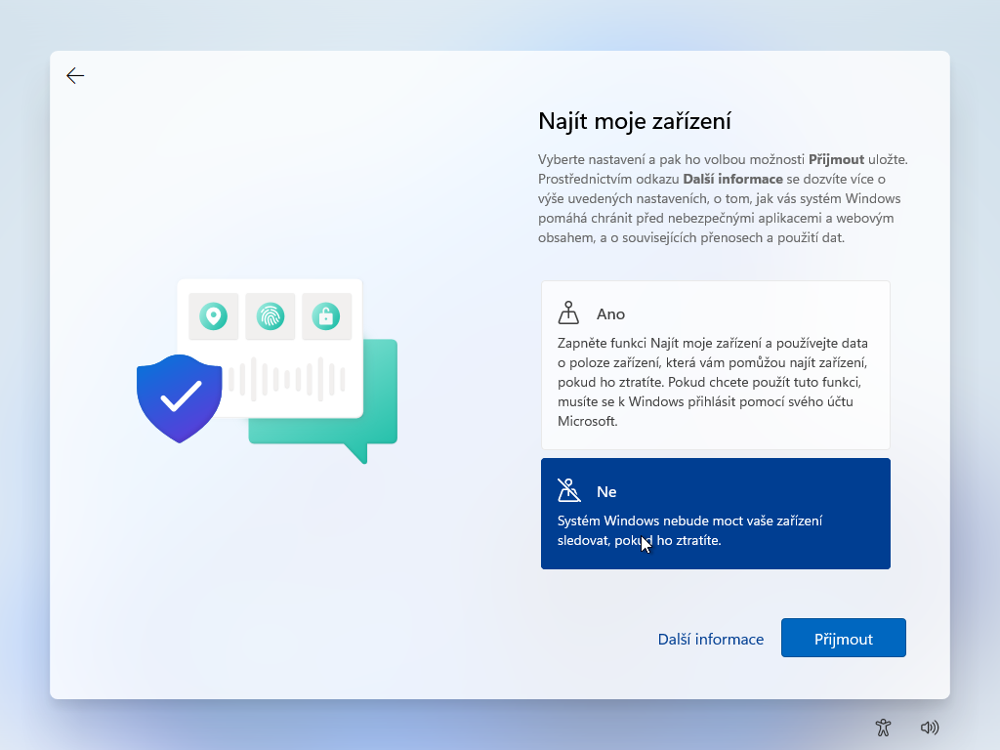

*A) Vytvoření instalačního média*
1. Stažení programu k vytvoření instalačního media ze stránek MS = Media creation tool.

2. Po kliknutí na ikonku aplikace se se zobrazí okno s: "Chcete této aplikaci povolit, aby prováděla na vašem zařízení změny?". Zvolíme možnost ANO.

3. Potvrdíme příslušná sdělení a licenční podmínky zvolením tlačítka Příjmout

4. Vybereme jazyk a edici. Pokud nechceme měnit, tak necháme zaškrtlé Použít doporučené možnosti pro tento počítač.

5. Zvolení typu media k vytvoření.
Vytvoření USB flash disku - pokračujte bodem 6.
Vytvoření ISO souboru - pokračujte bodem 7.

6. Zvolení typu media k vytvoření.
Vytvoření USB flash disku

7. Zvolení typu media k vytvoření.
Soubor ISO

Vyberte lokaci pro uložení ISO souboru a jeho jméno.

*B) Načtení instalace z vytvořené flash*
Flash vytvořena pomocí bodu 6. Flash vytvořena pomocí zápisu z ISO souboru z bodu 7. A to pomocí programů jako Rufus, Balena Etcher, Ventoy apod.
Flash zavedeme pomocí funkce boot menu nebo úpravou pořadí zavedení disku tj. boot order v rámci BIOSu.

*C) Průběh instalace Windows 11*
1. Potvrzení zavedení z flash
Press any key to boot from CD or DVD = Stiskem libovolné klávesy budete zavádět z CD nebo DVD

2. Klikneme na tlačítko Další

3. Klikneme na tlačítko Nainstalovat

4. Zadáme licenční klíč, který jsme zakoupili. Pokud je klíč uložen v BIOSu, nebude toto okno zobrazeno.
POZOR: Pro aktivaci lze použít licenční klíč z Windows 10
Klíč je možné zadat i později pomocí možnosti Nemám kód Product Key ('Postup v ad D)1.)

a vybereme edici, kterou chceme nainstalovat a později aktivovat.

5. Potvrdíme zaškrtnutím políčka Příslušná sdělení a licenční podmínky a pokračujeme kliknutím na tlačítko Další

6. Zvolíme možnost: Vlastní: Jenom nainstalovat Windows (pokročilé)
Nainstalujeme úplně čistý systém. Vyhneme se tak případným problémům s migrací. Důsledkem poškození souborů systému a následně k jeho nefunkčnosti (použitelnosti).

7. Na jaký disk nainstalovat?
Doporučení: Pokud máme v PC/Notebooku více disků. Je lepší nechat zapojený jen systémový a ostatní odpojit. Zabrání se tak ovlivnění dat na ostatních discích.
 
V případě reinstalace systému je nutné pro optimální fungování odstranit všechny oddíly systémového disku.

8. Instalujeme systém Windows

9. Opravíme pořadí disků
Pokud jsme v BIOSu nastavovali boot order nastavíme zpět systémový disk jako první.

10. Nastavení země nebo oblasti

11. Nastavení klávesnice a rozložení

12. Pojďme se připojit
Pokud máme internet, tak přejdeme k bodu 15.

Pokud nastane situace, že se nemůžete připojit k internetu.
Otevřeme si příkazový řádek klávesovou zkratka SHIFT+F10. Napíšeme příkaz: *OOBE\BYPASSNRO*.

Instalátor se restartuje a povolí se možnost Nemám internet.

Klikneme na Pokračovat s omezenou instalací

13. Pojmenování zařízeni

14. Nastavení zařízení

15. Přihlášení (vytvoření účtu)

Účet MS nechceme používat. Aktivujeme si tedy offilne účet!
Uživatelské jméno: admin

Heslo: password

následně nám to vyhodí chybu. Pokračujeme tlačítkem další

Zvolíme si jméno uživatele. Např.: uzivatel

Heslo necháme prázdné = Automatické přihlášení na plochu

16. Povolení sběru dat pro MS

17. Poslední nastavení a hurá na plochu

*D) Aktivace, aktualizace a ovladače*
1. Zkontrolujeme jestli se Windows aktivoval

Najdeme v Nastavení -> Aktivace
a pokud  jsme neaktivovali, tak klič zadáme pomocí tlačítka Změnit 

2. Vyhledáme a nainstalujeme aktualizace systému přes Windows Update
Doporučení: Tento krok opakujte tak dlouho, dokud se systém neřekne, že vše vyhledal a je aktuální

3. Nainstalování chybějících ovladačů
Potřebné ovladače najdete na stránkách výrobců základních desek, grafik a dalších rozšiřujících karet atd.
Při hledání konkrétního ovladače může pomoct i správce zařízení a Hardware ID, které zadáme o vyhledávače a najdeme tak název zařízení, pro který ovladač hledáme.

