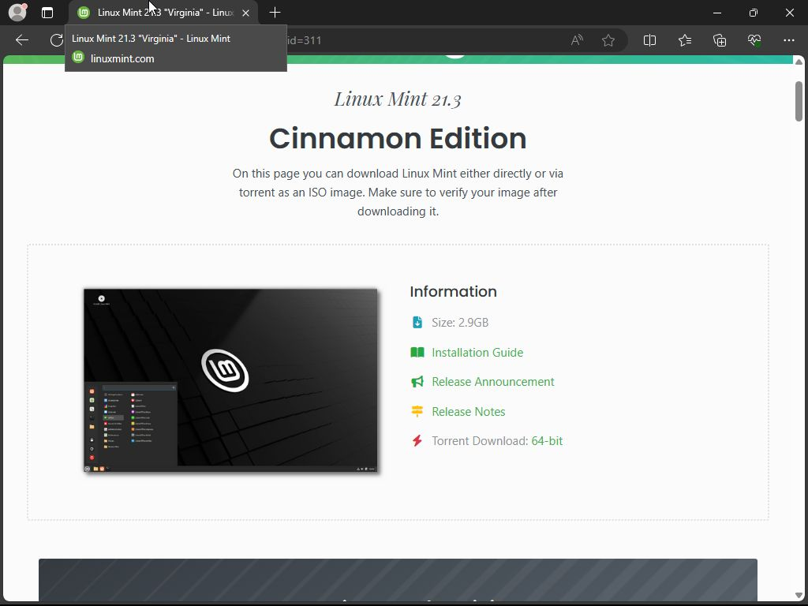

### Úvod

**Linux Mint** je linuxová distribuce pro notebooky a osobní počítače. Distribuce je založena na Ubuntu/Debianu ale  nabízí jiné aplikace a jiné uživatelské rozhraní. Mint je konzervativní distribuce s tradičním rozvržením desktopu. Uživatelé Windows si na něj snadno zvyknou. V základu jsou na výběr prostřední Cinnamon, MATE nebo Xfce.

### Stažení ISO souboru

1) Otevřeme si stránky [Linux Mint](https://www.linuxmint.com/) a klikneme na tlačítko [**Download**](https://www.linuxmint.com/download.php).

2) Vybereme edici **Cinnamon Edition** a opět klikneme na tlačítko **Download**.

3) V této části stránky sjedeme níže v **Download mirrors** na řádky **Czech Republic**, vybereme libovolný odkaz a bude zahájeno stahovaní **ISO souboru**.

### Zápis ISO souboru na Flash disk

- **[Rufus](/navody/rufus-zapsat-obraz-medii/)** Stažený ISO zapíšeme na **Flash disk** nebo jiné **paměťové médium**
- **[Balena Etcher](/navody/balenaetcher-zapsat-obraz-medii/)** Stažený ISO zapíšeme na **Flash disk** nebo jiné **paměťové médium**
- **[Ventoy](/navody/ventoy-zavadeni-obrazu-medii/)** Stažený ISO soubor přesuneme na datový oddíl **Ventoy Flash disk** nebo jiné **paměťové médium**

### Po zavedení z Flash disku

1) Necháme zvolenou první možnost a potvrdíme klávesou **ENTER**.

2) Vyčkáme na načtení systému z **Flash disku**.

3) **Průzkumník** zde máme jako světle oranžovou složku, ve kterém si pak snadno můžeme připojit disk s poškozeným systémem a za zálohovat si svá data. Šipečka vpravo od jednotný slouží k bezpečnému odpojení disku.

4) Po ukončení veškeré práce s obnovou a odpojením disků můžeme ukončit práci v **Linux Mint**. Klikneme na start (symbol Linux Mint), symbol vypínače (červené tlačítko), vybereme **Restart** = restartovat nebo **Shut Down** = vypnout a vypojíme **Flash disk**.

