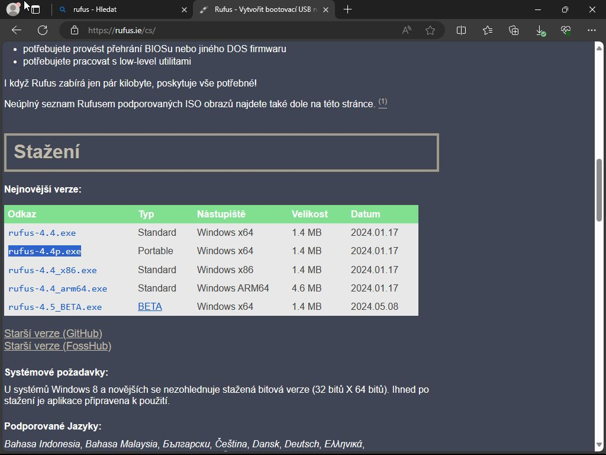
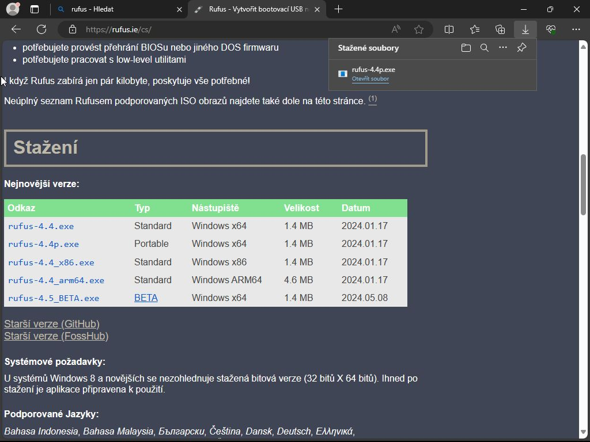
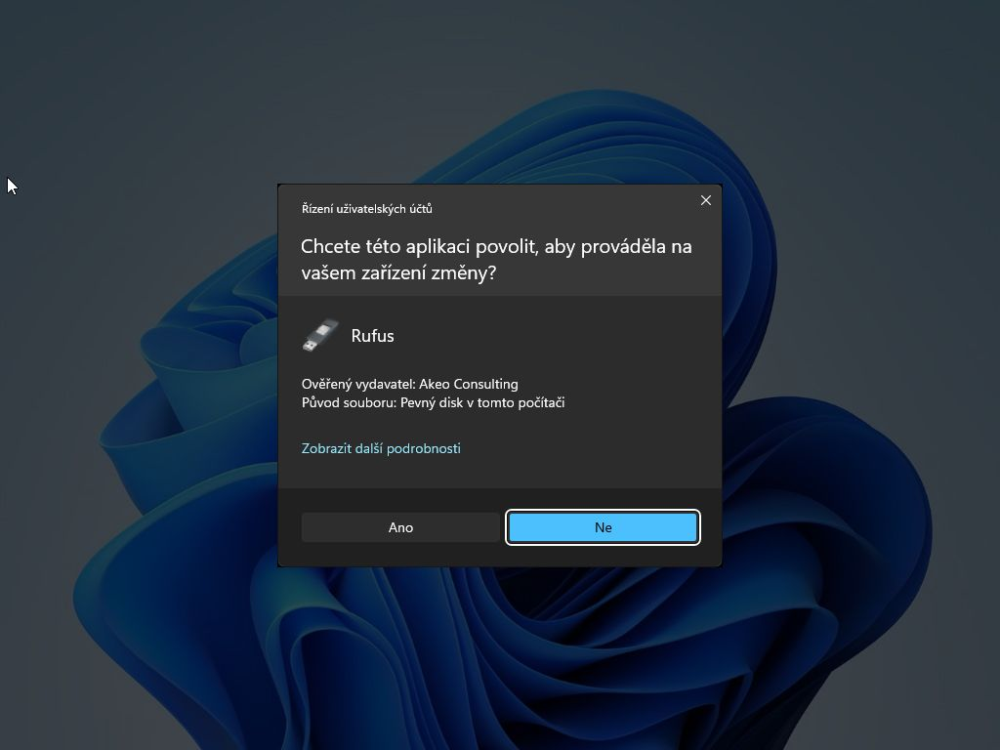
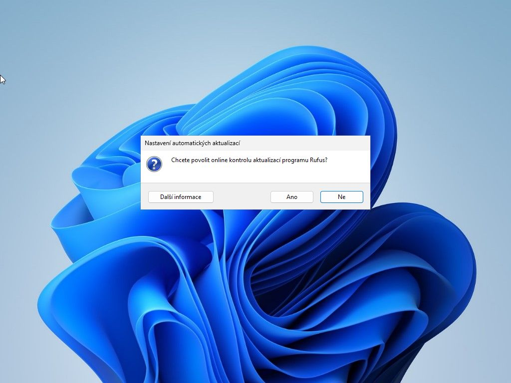
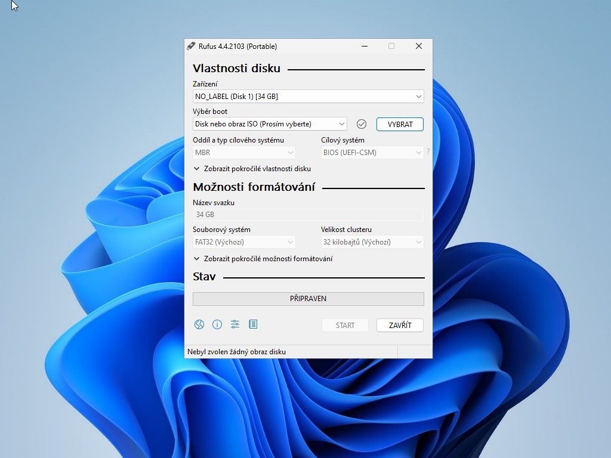
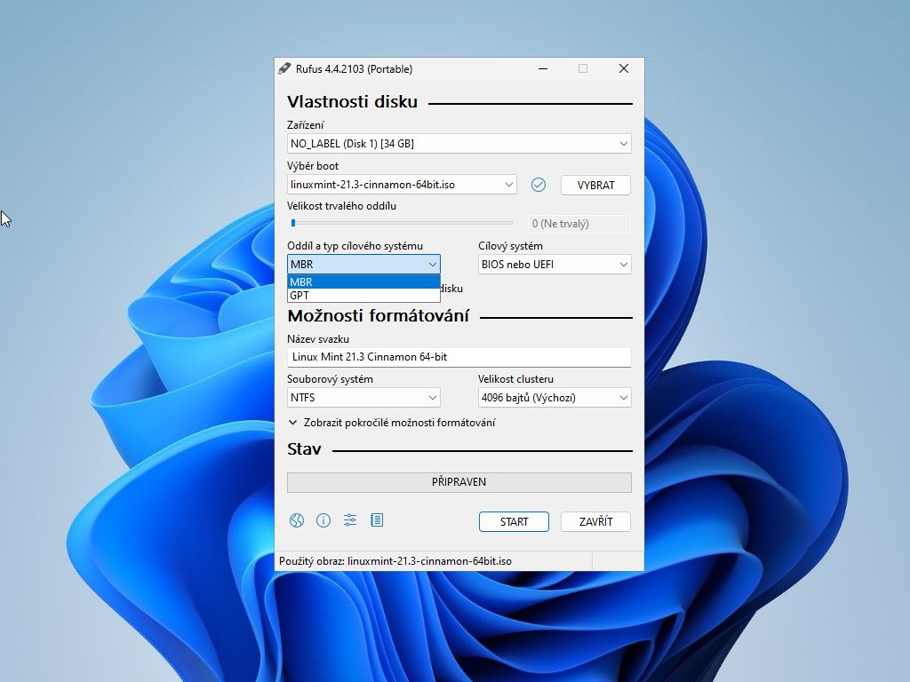
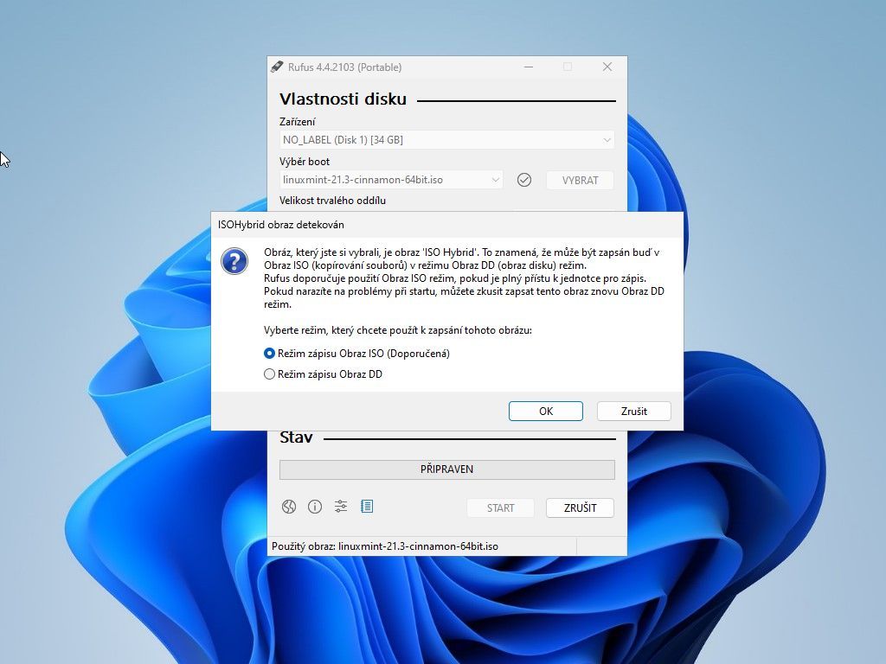
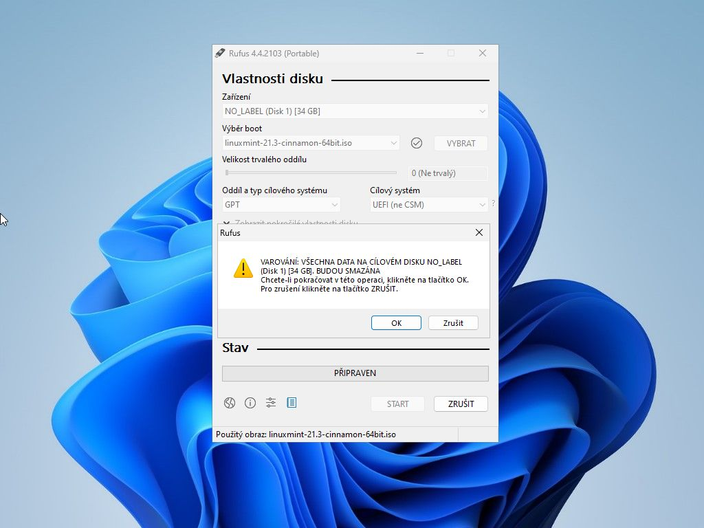
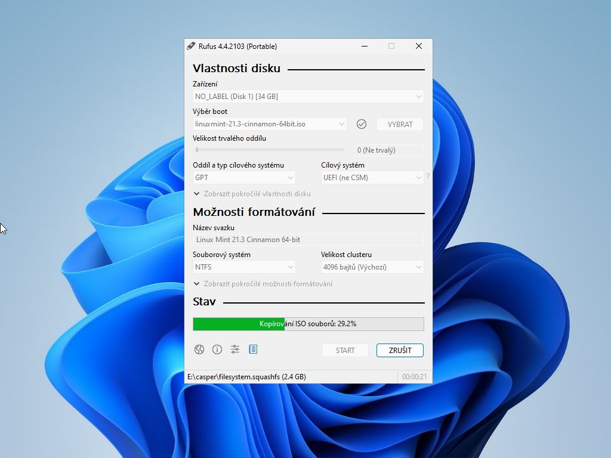
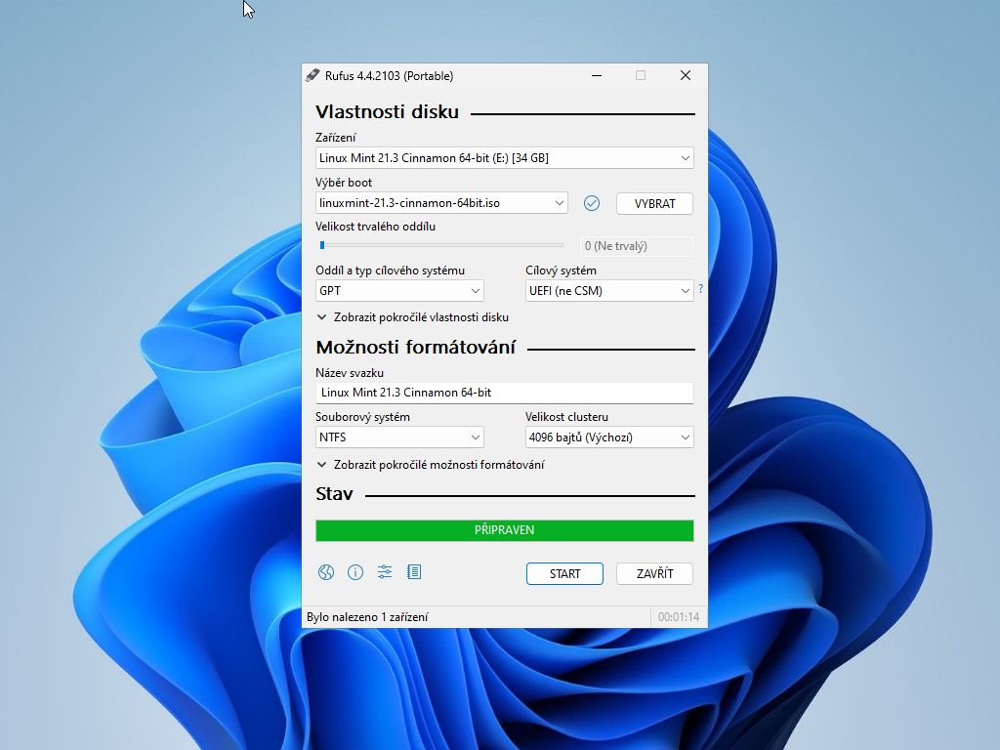

### Co je Rufus

**Rufus** je malý program pro Windows určený pro vytváření bootovatelných USB médií z obrazů.

### Stažení programu

1) Otevřeme si webové stránky **[Rufus](https://rufus.ie/)** a v sekci **Stažení** vybereme potřebnou verzi.

2) Nainstalujeme/Spustíme. Aplikace po nás bude chtít pár potvrzení. Jako první bude informace o možnosti provádět změny - potvrdíme **Ano**.

3) Automatické aktualizace
\
**Ano** - pokud jsme použili instalátor
\
**NE** - pokud jsme použili přenositelnou (dočasnou)

4) Prostřední programu
\
    a) Jednotlivé části
    \
    **Zařízení** - vybereme úložiště na který budeme chtít zapisovat.
    \
    **Výběr boot** - Tlačítkem **VYBRAT** vybere obraz souboru, který chceme zapsat.
    
    **Oddíl a typ cílového systému**
    \
    MBR - starší počítače, které nepodporuji UEFI
    \
    GPT - novější počítače s podporou UEFI
    

    b) Typ zápisu na médium - **Neměníme**
    
        
    c) Varování, že data na cílovém medii budou smazána. **Doporučujeme předem za zálohovat citlivá nebo cenná data.**
    

    d) Průběh zápisu a jeho úspěšné dokončení.
    
    
