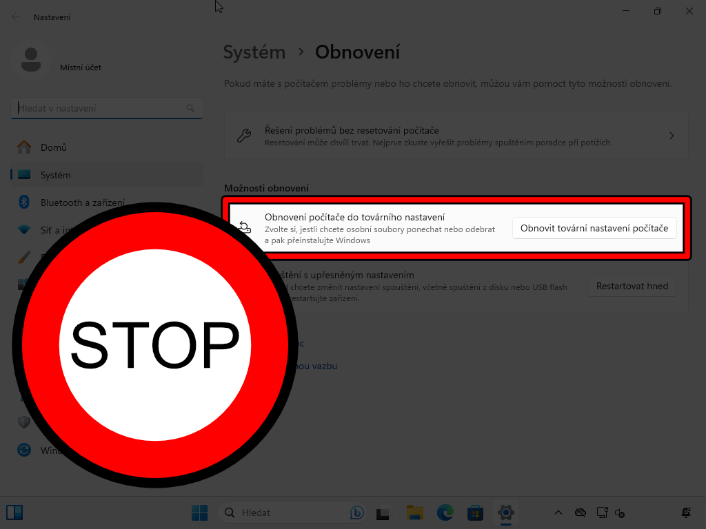

### Rozmohl se nám tady takový nešvar - Tovární nastavení ve Windows!

Dennodenně na Discord serveru [GeekBoy](/zajimavosti/geekboy/) se setkávám s uživateli Windows, který přijdou požádat o pomoc s opravou nefunkčního systému Windows. A to právě po neúspěšně provedeném **Obnovení počítače do továrního nastavení**.

Rád bych tímto článkem sdělil, proč je tato funkce zbytečná, zničující a ztráta času.

### Proč?

- proces je zdlouhavý (doslova hodiny čekání)
- má náchylnost k selhání (přerušení během procesu)
- ztráta dat - BFU (Běžný Franta Uživatel) nezná způsob, jak data získat zpět jinak (doporučení: live usb s Linux Mint)
- opakované opravy opravou, jen zvyšuje riziko problému (Diktát z češtiny také nemůžete opravovat do nekonečna) 

Ano, jsou případy, kdy je tovární nastavení úspěšné. Dříve nebo později se ale setkáte se dalším problémem.

# Otestujeme chování ve virtuálním počítači

### Vytvoření virtuálního počítače

Jako příklad jsem vytvořil virtuální počítač ve **VirtualBoxu** s náledujícím nastavením:

- Procesor: 4 jádra
- Paměť RAM: 8 GB
- Disk: 60 GB
- Boot: UEFI a Secure Boot zapnuté
- Systém: Windows 11 Pro (23H2)

### Po nainstalování čistého systému

Jedná se o stav ihned po dokončení čisté instalace bez aktualizací, programů a jiných nastavení.

- Trvání procesu: **20 minut**
- Využití disku: **39,2 GB volných**
- Vyčištění disku: **13.7 MB** (zbytečné soubory po instalaci k odstranění)

### Tovární nastavení

**Obnovu počítače do továrního nastavení** najdeme v **NASTAVENÍ -> SYSTÉM -> OBNOVENÍ**.

Máme zde na výběr dvě možnosti obnovy:
- **Zachovat moje soubory** = tuto volbu volí většina uživatelů, protože nemají nebo nezálohují data. Zvolíme tuto možnost pro náš test. 
- **Odebrat všechno**

V podmenu máme pak tyto možnosti:
- **Stažení z cloudu** = tato volba stáhne veškeré soubory nové instalace (instalačního média)
- **Místní přeinstalace** = Využije data z nainstalovaného systému. Zvolíme tuto volbu pro náš test.

Program nám ještě před spuštěním ukáže rekapitulaci zvoleného nastavení.

Spuštění procesu obnovy.

### Po provedení "Obnovy počítače do továrního nastavení"

Jedná se o stav ihned po dokončení obnovy, dle nastavení.

- Trvání procesu: **60 minut**
- Využití disku: **38,6 GB volných**
- Vyčištění disku: **744 MB** (zbytečné soubory po instalaci k odstranění)

### Zajímavost

Program obnovy si dovolil smazat 2 systémové programy z nově nainstalovaného Windows. Opravdu zábavné.

# Shrnutí

Výsledkem tohoto testu, je potvrzení známé reality a to, že program **Obnova počítače do továrního nastavení** není:

- Rychlá záchrana = V případě selhání se uživatel potřebuje co nejrychleji vrátit do funkčního/použitelného systému a pokračovat v práci. Čekat **20 minut** a nainstalovat nutné programy, nebo **60 minut** a bát se, že ani potom to nebude fungovat. 
    - Doporučuji: Bitovou kopii, Klon disku a Zálohování

- Spolehlivá cloud obnova = Ze zkušenosti víme, proces obnovy může kdykoliv selhat. Pak ne všichni mají rychlý a stabilní internet. Tato možnost obnovy mi přijde velmi riziková a byly by to další minuty navíc z důvodu stahování dat z netu.

- Logická = Proč odinstaluje program, který je součástí systému a instalace je čistá? Nechápu :D

# Závěrem

Ušetřete si svůj čas a průběžně si zálohujte svá důležitá data, aby jste se nemuseli bát [**ćisté instalace Windows pomocí flash disku**](/navody/instalace-windows-11/).