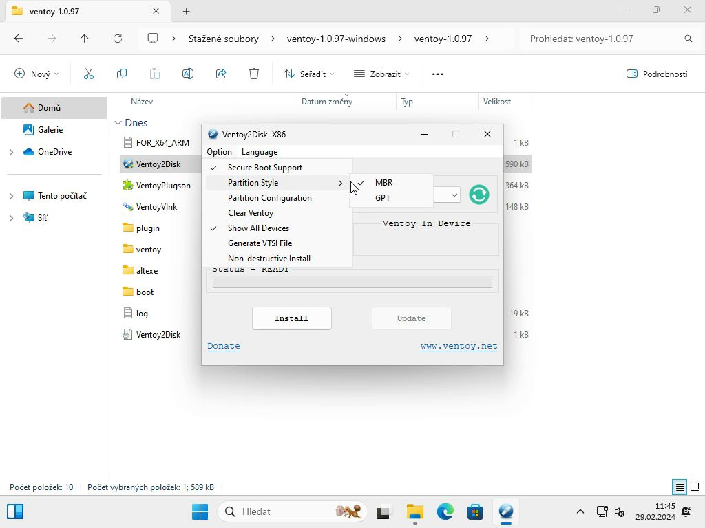

### Co je Ventoy?
Flash disk nebo jiné úlozné médium vytvořené pomocí Ventoy umožní pomocí automaticky vygenerováného menu vybrat jáký obraz disku (média) chcete načíst. A to vše bez nutnosti přepisování celého disku. Jednoduše stačí vložit soubor na programem vytvořený oddíl a poté tyto soubory, jen aktualizovat.

### Jak vytvořit Ventoy flash/disk?

1. Stáhneme balíček ze stránek [Ventoy](https://www.ventoy.net/).

2. Rozbalíme stažený baliček do složky a spustíme program **Ventoy2Disk.exe**.

3. Povolíme provádění změn volbou **Ano**.

4. Vybereme typ oddílu\
V nabídce **Option\Partition Style** zkontrolujeme typ oddílu:\
**MBR** = v případě starého BIOSU, 
**GPT** = v případě nového biosu (UEFI)\

5. Vybere v **Device** na jaké uložiště/flashku chceme nahrát Ventoy. Dáme **Install**.

6. Potvrdíme varování o přepisu dat (2x)

7. Vyčkáme na dokončení instalace.

### Prostředí Ventoy

1. Do nově vytvořeného oddíllu (disku) nahrajeme naše soubory

2. Zavedení nové Ventoy flashky\
Pokud vše proběhlo správně, měli bychom uvidět menu Ventoy se seznamem námi nahraných souborů.\
Ovládání: Šipky = Pohyb, Enter = Potvrzení

\
Ukázka úspěšného načtení nahraného souboru.

