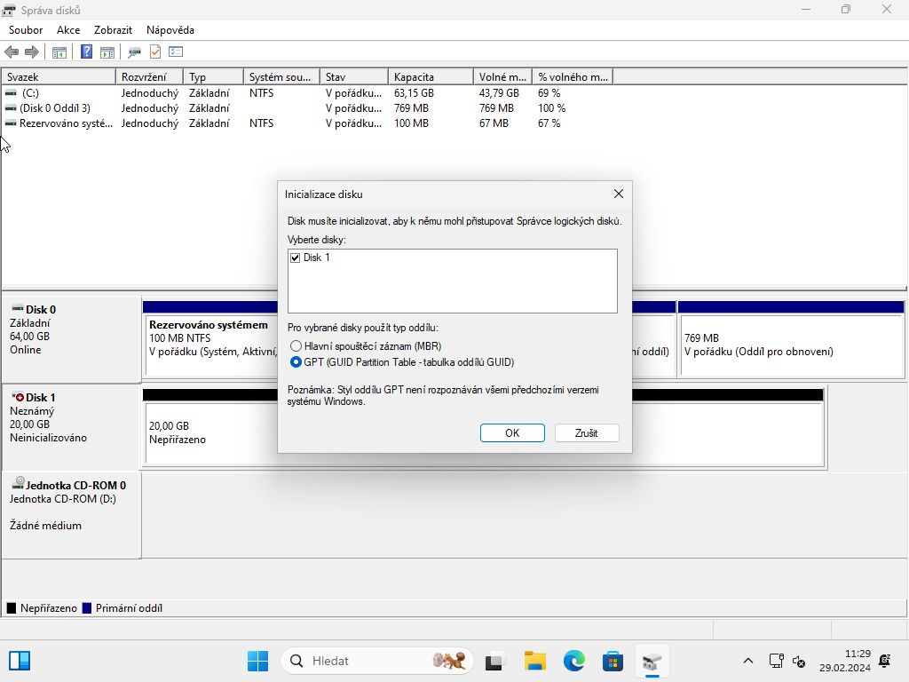
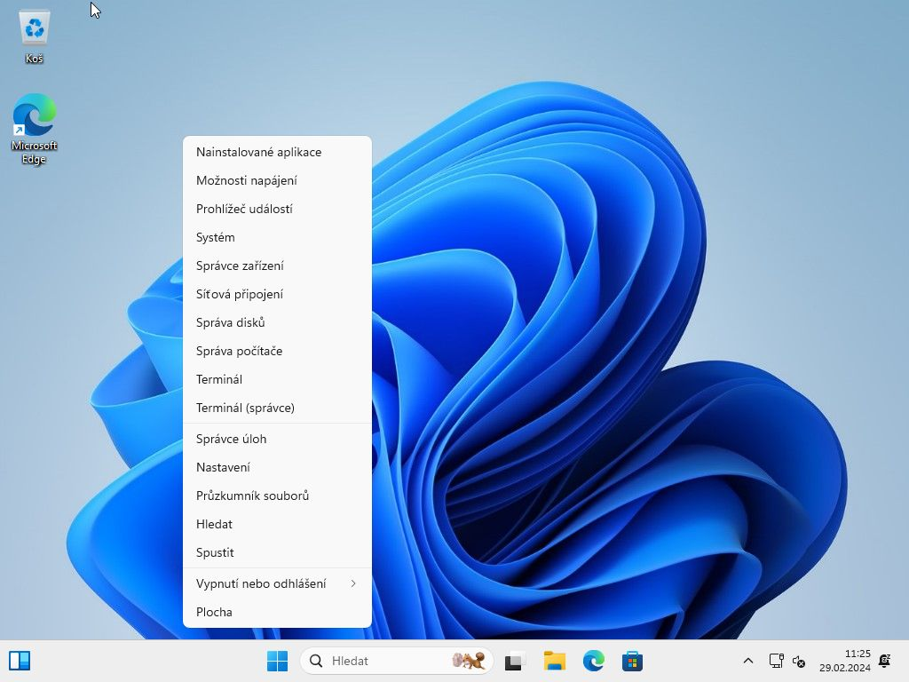
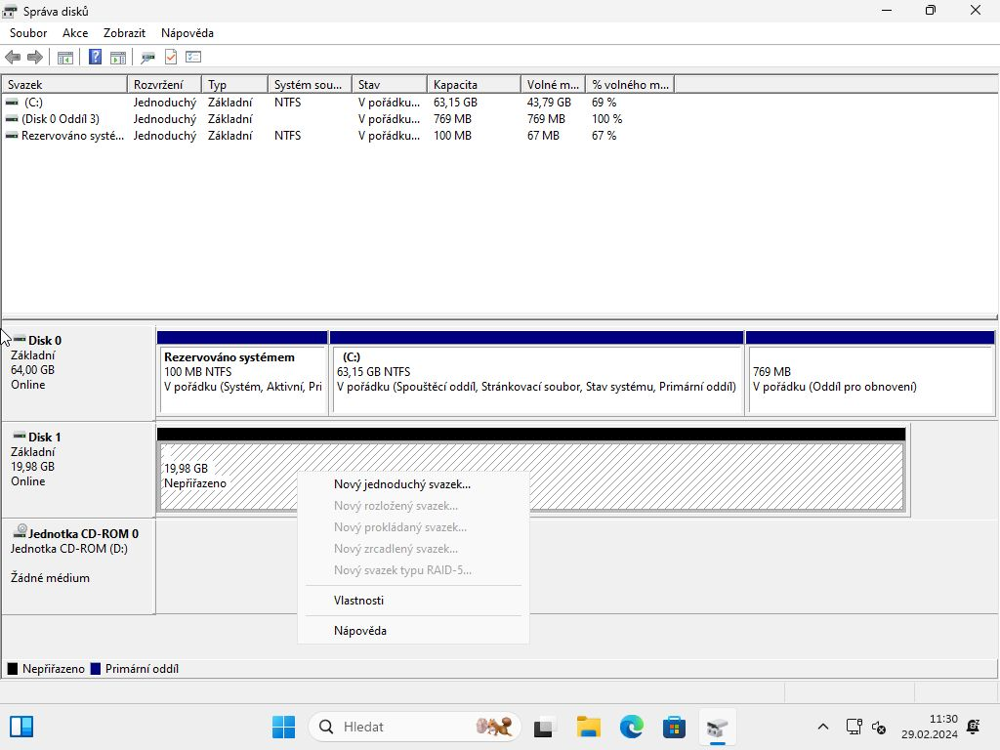
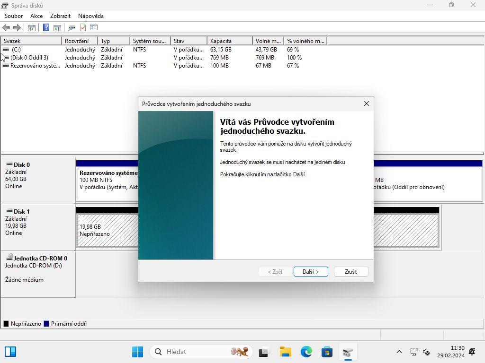
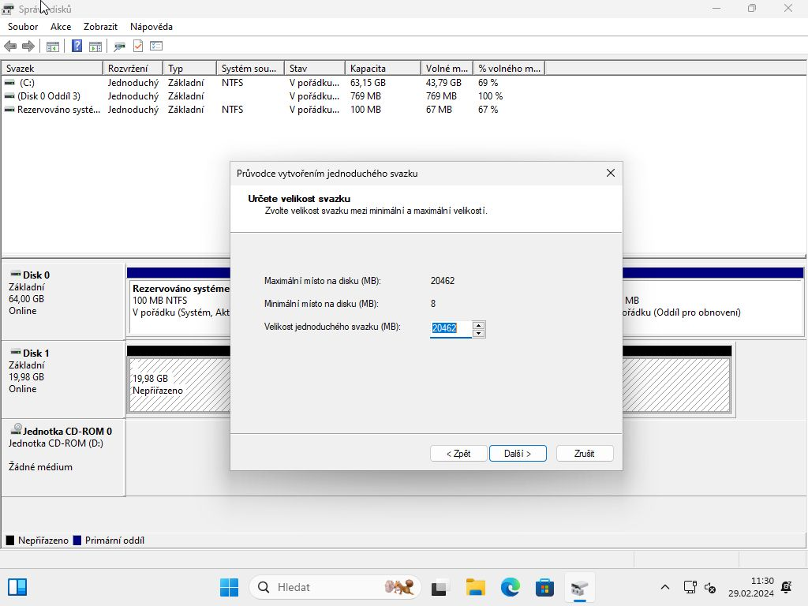
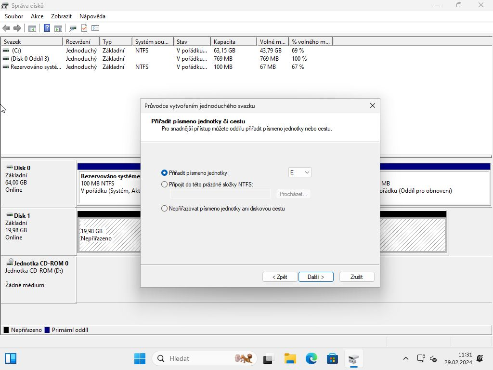
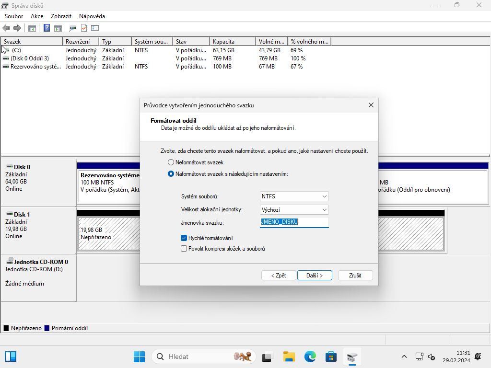
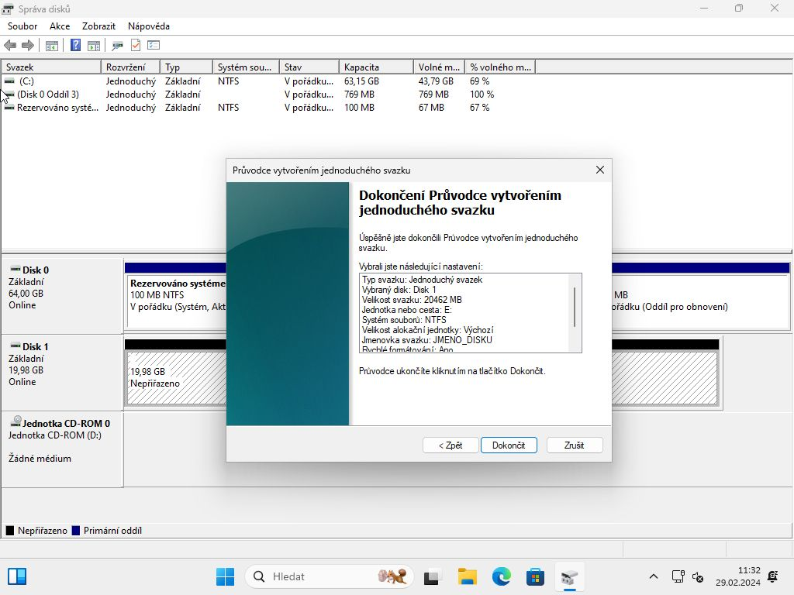
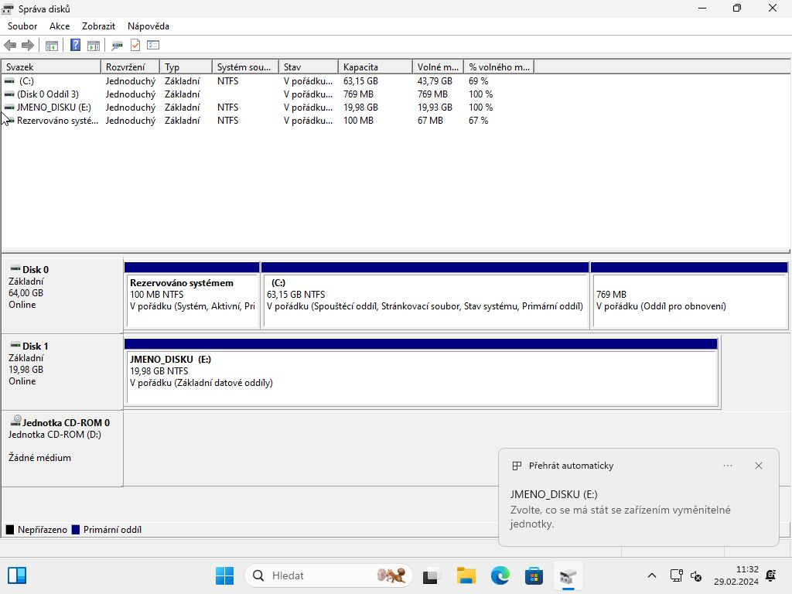
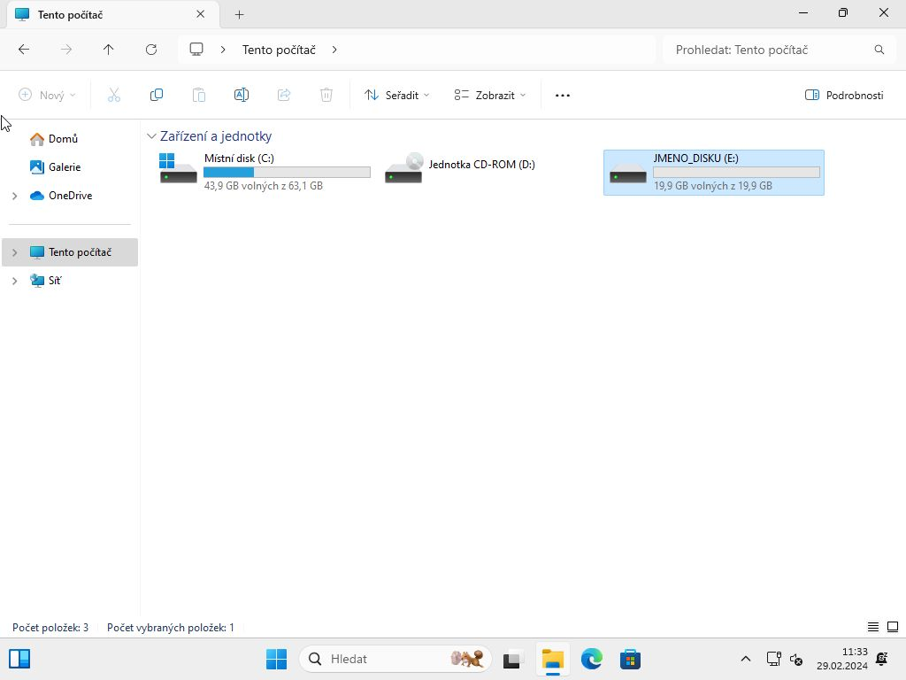

### A) Nový disk a správce disku

Sestavili jste nový počítač a po nainstalování systému [Windows](../instalace-windows-11/) nevidíte další disky v **Tento počítač**.

### B) Inicializujeme nový disk

1. Otevřeme **správce disku**

Pravým tlačítkem myši klikneme na **START** a vyberte **Správa disků**

2. Inicializace disku

Po otevření správce disku vyskočí okno **Inicializace disku**, kde vybereme v typ oddílu: **GPT** a potvrdíme **OK**.

### C) Vytvoření oddíl

1. Klikneme pravou myší na nový disk (označen černým pruhem) a vybere z menu volbu: **Nový jednoduchý svazek**

2. Projdeme průvodce vytvoření jednoduchého svazku\
Pokud nechcete něco specifického změnit, tak stačí jen proklikat průvodce.

3. Po úspěšné vytvoření vyskočí dialog a disk uvidíme v **Tento počítač**.

