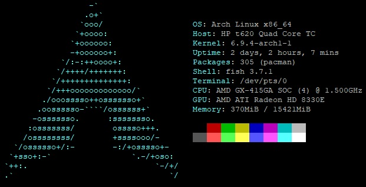

### Úvod
K pořízení domácího serveru jsem se rozhodl z důvodu hraní [Minecraftu](https://www.minecraft.net/), který jsem provozoval na svém notebooku [Lenovo X270](/vybaveni/notebook/), ale ventilátory v zátěži jely na maximální otáčky a bylo to rušivé. Hledal jsem řešení, který by bylo pro tento účel vyhovující - **tiché, malé a levné**. Uvažoval nad zakoupení Raspberry PI 5, ale zde mě odradila především cena přesahující **2000 Kč**, při pořízení základní verze 8GB, bez příslušenství.

### Našel jsem vítěze!
Když lidé z discordu [GeekBoy](/zajimavosti/geekboy/) diskutovali o nakupování malých počítačů z Allegra, že se tam dají najít zajímavé kousky z Polska za super ceny. Neváhal jsem a šel hledat. A pak to přišlo. Narazil jsem na **HP T620 (GX-415GA)** z Polska a to za pouhých **1291 Kč + 99 Kč (doprava)**. Odkaz na nabídku najdete [ZDE](https://allegro.cz/nabidka/mini-pc-terminal-hp-t620-amd-gx-415ga-4x-cpu-16gb-128gb-ssd-vyprodej-15111538507).

Doručení bylo rychlé. Balík mi doručovalo We|Do.

### Co je HP T620 (GX-415GA)
Jde o konfiguraci se 4 jádrovým procesorem **AMD GX-415GA** s taktem **1,5GHz**, osazený **16GB DDR3** pamětí a uložištěm **128GB** M.2 mSATA SSD diskem od Samsungu (model: MZNLN128HAHQ-000H1). Počítač byl doručen vč. stojánku a adaptéru (bez kabelu do sítě - trojlístek koncovka). Pro více informací o tomto počítači najdete na stránkách [HP](https://support.hp.com/us-en/document/c04017240). Naměřená provozní teplota se pohybuje okolo **50°C**, což je na čistě pasivně chlazený počítač bezva.

### Operační system a další software
Jako operační systém jsem pro účely hostování domácího MC serveru, přesněji: [Majnr Plus](https://www.curseforge.com/minecraft/modpacks/majnr-plus) zvolil [Arch Linux](https://archlinux.org/). Pro hraní po internetu využívám služeb [PLAYIT.GG](https://playit.gg/), který poskytne rychlé a snadné propojení dalších hráčů odkudkoliv z internetu, bez nutnosti mít veřejnou IP adresu. [TeamSpeak Server](https://teamspeak.com/) pro komunikaci během hraní. Počet připojených klientů **1-3**.
