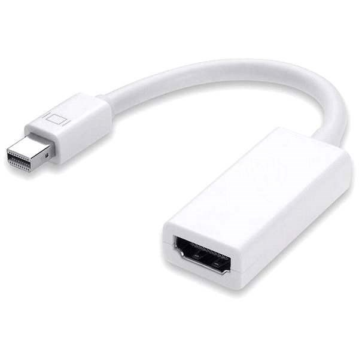

*Lenovo X240*

Notebook prošel úpravami: Disky, RAM, Display (1920x1080)

---

*Samsung 850 EVO (250GB)*

---

*Transcend MTS 430S M.2 SSD (256GB)*

Záloha je důležitá, pro případ selhání systému, nebo systémového disku

---

*PremiumCord Mini DisplayPort HDMI M/F*

Pro možnost připojení dalšího monitoru
