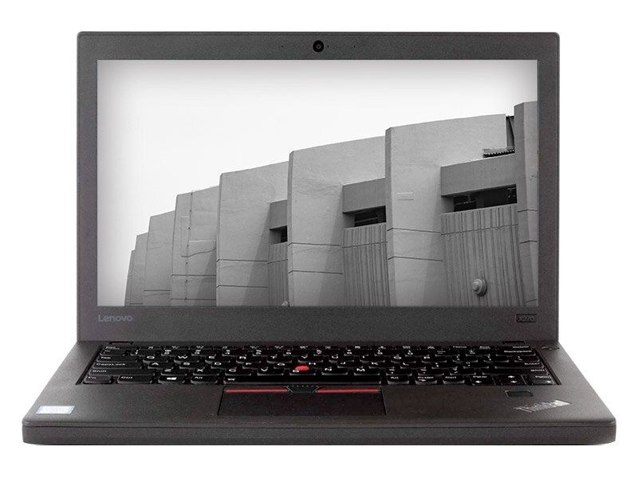
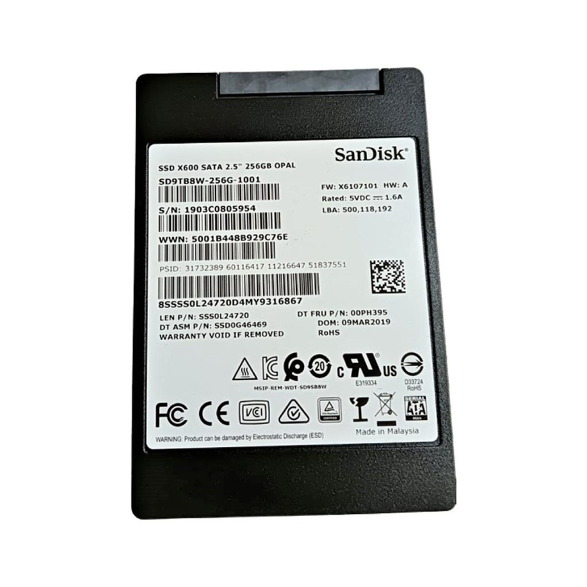
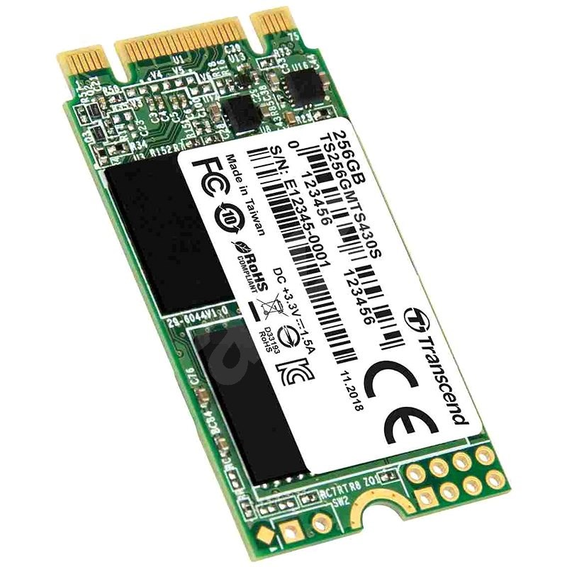

*Lenovo X270*

Starý notebook X240 byl nahrazen za tento v konfiguraci: i5-6300U, 16GB, 2x 256GB disk, HDMI, USB-C

---

*SanDisk X600 (256GB)*

---

*Transcend MTS 430S M.2 SSD (256GB)*

Záloha je důležitá, pro případ selhání systému, nebo systémového disku
