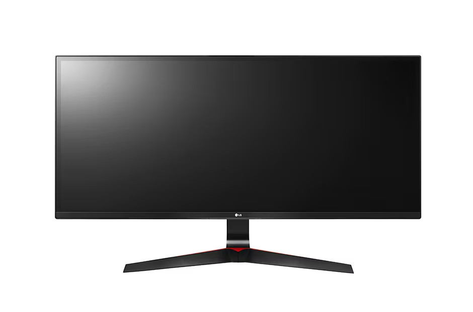

*Noctua NH-D15 (Chladič)*

Jeden z nejúčinnějších vzduchových chladíčů pro procesory.

---

*Axagon CRI-S3 (Čtečka karet)*

Občas nastane chvíle, kdy potřebuji něco vytáhnout z karty.

---

*Seagate Barracuda 2TB (2x) Raid 0 (Disk)*

Raid pole pro zálohu dat.

---

*Seagate Barracuda 2TB (Disk)*

Disk je primárně určený na hry. Nehraju takové hry, které by nutně vyžadovaly rychlé Nvme SSD.

---

*Samsung HD322HJ 300GB (Disk)*

Starší disk, který využívám jako dočasný velký odpadkový koš. Všechnen bordel přesunu na něj a později to přeberu.

---

*Seagate SkyHawkk 4TB (Disk)*

Úložného prostoru není nikdy dost! :D

---

*KBG30ZMT256G TOSHIBA M.2 256GB (Disk)*

Tento disk mám z notebooku, kde proběhla výměna za jiný.

---

*Samsung SSD 960 Evo M.2 250GB (Disk)*

Systémový disk

---

*Nvidia GTX 1050ti 4GT OC (Grafická karta)*

Grafika ještě z původního PC. Pořízená 2017, jako náhrada za ATI HD 5870. Stále obstojná grafika - zobrazuje a to je hlavní. Zajišťuje obraz 3x 2560x1080 tj. 7680x1080.

---

*CZC.Gaming Halfling (Klávesnice)*

Klávesnici jsem zakoupil ze zvědavosti a vyzkoušení této velikosti. Začátky byly perné, ale zvykl jsem si rychle a jsem spokojen. Pohodlně, rychle a snadno se na ní píše.

---

*LG 25UM65-P 2560x1080 (Monitor)*

---

*LG 25UM58-P 2560x1080 2x (Monitor)*

---

*Samsung SyncMaster S2B350BS 1920x1080 (Monitor)*

Nachází se u konzole. Pro sledování videí a chatu při hraní.

---

*Waveshare 7" dotykový (Monitor)*

Malý monitor, napájený přes USB. Využíván jako nouzový monitor při nedostatku místa, pro ovládání hudby a nebo jako servisní monitor k PC.

---

*Logitech Marathon Mouse M705*

Obyčejná, ale přesto úžasná myš.

---

*Corsair Vengeance LPX Black 32GB (2x16GB) DDR4 2666*

---

*Intel Core i7-8700K*

---

*Corsair Graphite Series 780t*

---

*Seasonic M12II-620 Evo (620W)*

---

*ASUS Z370-A Prime*

