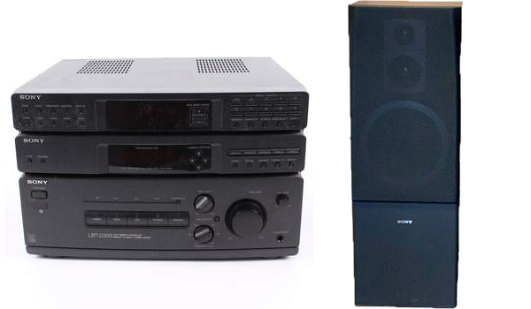

*Axagon USB3.0 (Dokovací stanice na disky)*

Snadná a rychlá práce s disky - zálohování, servis

---

*Magic General (starší generace) (Dálkový ovladač)*

Nechce se Vám stávat z postele, tak si pořiďte ovladač k PC. Fukce jak klávesnice, tak i myši.

---

*WD Elements Desktop - 3TB (Externí disk)*

Přenášení souborů, zálohovaní notebooku, PC

---

*LG GP57EB40 (Externí DVD mechanika)*

A

---

*sE V7 BBB (BEATBOX BATTLE WORLD CHAMPIONSHIP 2018) (Mikrofon)*

Jedná se o limitovanou edici vytvořenou k příležitosti Mistrovství světa v beatboxu 2018 v Berlíně. Aktuálně se těžko schání je to spíše o štěstí

---

*Behringer XENYX Q502 USB (Zvuková karta)*

Propojení PC, Notebooku a konzole, napojen mikrofon. Není potřeba nic zapojovat, přepnu a mohu volat

---

*Samsung SL-M2070W*

Tiskne, skenuje a to rychle.

---

*Synology DiskStation DS218+*

Pro zálohovaní všech zařízení v lokální síťi i mimo ní. Osazen: 2x 8TB (Seagate IronWolf), Doplněno: navýšeno na 16GB ram.

---

*Sony STR-D309 + SONY SS-E315*

Stará Hi-Fi (1993), ale super

---

*ASUS RT-AC66U B1*

---

*AUDIO-TECHNICA ATH M40x*

Výměna za starší bezdrátové od Sony. Mega rozdíl. Spokojenost.

---

*BESPECO MSRA10*

---

*Stell SOS 2030 plynový držák monitorů + úchyt ze Stell SOS 1030*

Nastavitelnost, pevnost, hodně volného místa na stole další bordel.

---

*Logitech G29 + řadící páka*

Vůně benzínu, to je moje.

---

*DXRacer Formula*
